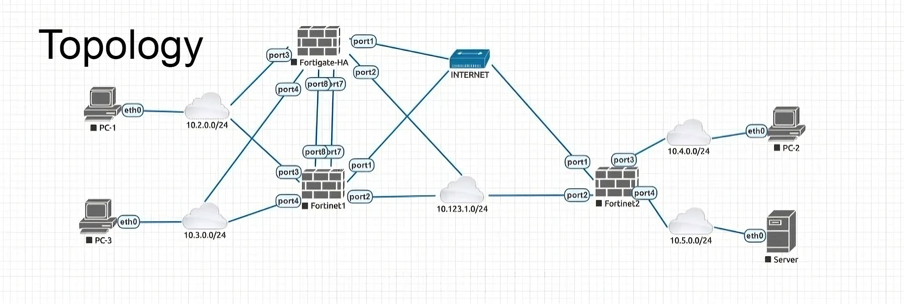

# Fortinet Cybersecurity Project - NTI Summer Training

## Project Overview
This project was completed as part of the **Summer Training at the National Telecommunication Institute (NTI)** in the Fortinet Cybersecurity track. The goal was to design and implement a secure network topology using multiple FortiGate Firewalls to simulate a real-world enterprise environment.

## Network Topology
 

## Key Features & Configurations
The project demonstrates the following cybersecurity and networking concepts:

* **Site-to-Site VPN:** Established a secure VPN tunnel between FW1 and FW2 to encrypt traffic between remote sites.
* **High Availability (HA):** Configured HA on FW1 and FW3 to ensure network resilience and seamless failover in case of hardware failure.
* **Security Policies:** Implemented granular firewall rules to enforce network segmentation and traffic control.
* **NAT/DNAT:** Applied Network Address Translation rules to allow internal clients to access the internet and publish internal services securely.
* **Web & URL Filtering:** Restricted access to specific sites (e.g., YouTube) for internal users on PC3 to demonstrate content security.

## Verification & Results
The following tests were performed to verify the implementation:
1.  **Connectivity:** Successful ping tests between PC1 and PC2 over the VPN tunnel.
2.  **Internet Access:** PC3 successfully accessed the internet through the configured NAT policies.
3.  **Security Enforcement:** Verified that URL Filtering successfully blocked restricted content.

## Tools Used
* **Firewall:** FortiOS (FortiGate VM)
* **Environment:** VMware Workstation
* **Testing:** Windows/Linux Clients (PCs)
